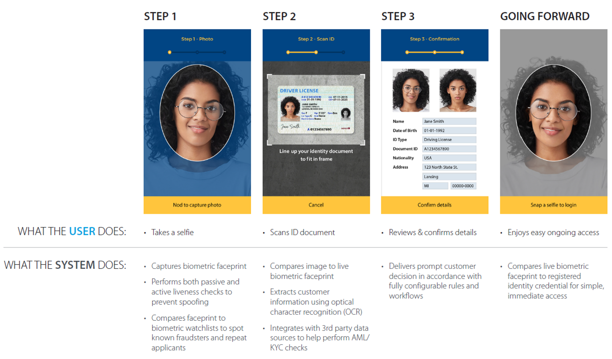
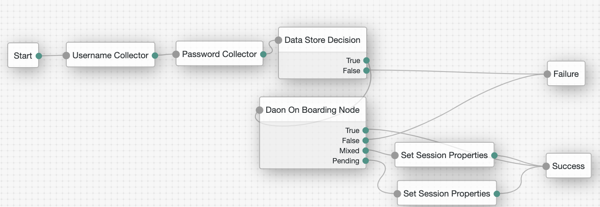
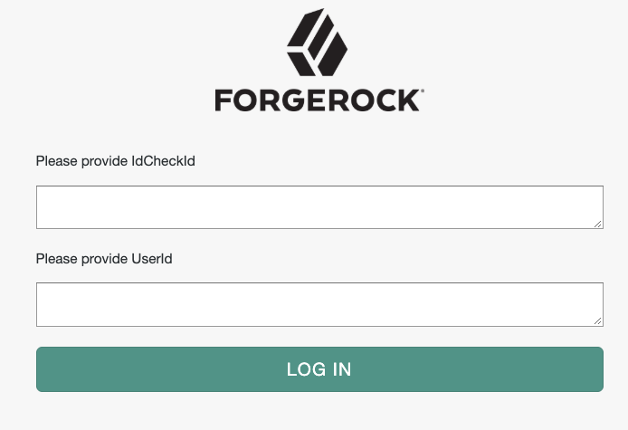

# Daon IdentityX Onboarding Node

Daon's IdentityX platform is helping customers across the globe ditch passwords and deliver world-class customer
 experience by leveraging biometrics. This node allows ForgeRock customers to easily add Daon On Boarding status
  checks to authentication trees.

## About Daon ##
Daon, [www.daon.com](www.daon.com), is an innovator in developing and deploying biometric authentication and identity assurance solutions worldwide. Daon has pioneered methods for securely and conveniently combining biometric and identity capabilities across multiple channels with large-scale deployments that span payments verification, digital banking, wealth, insurance, telcos, and securing borders and critical infrastructure. Daon's IdentityX® platform provides an inclusive, trusted digital security experience, enabling the creation, authentication and recovery of a user’s identity and allowing businesses to conduct transactions with any consumer through any medium with total confidence. Get to know us on [Twitter](https://twitter.com/DaonInc), [Facebook](https://www.facebook.com/humanauthentication) and [LinkedIn](https://www.linkedin.com/company/daon).

## IdentityX Onboarding ##

Daon's IdentityX Onboarding provides the functionality required to support prospective tenants of an existing IdentityX system who want to collect, assess and evaluate the supported data provided as part of a new customer application process. In a typical scenario, applicants can apply for an account by simply taking a selfie for enrollment, then scanning their documents, and performing liveness checks.

## Installation ##
Download the current release [here](https://github.com/JBeloncik/daonOnBoardingNode/releases/latest)

Copy the jar file into the ../web-container/webapps/openam/WEB-INF/lib directory where AM is deployed.  Restart the web container to pick up the new node.  The node will then appear in the authentication trees components palette.

## USING THE NODE IN YOUR TREE ##

### There is one node included ###
- **Daon On Boarding Node** This node makes a REST API call to IdentityX to check the status of the Daon On Boarding
 flow.

### CONNECTING TO AN IDENTITYX SERVER ###
The node must be configured to connect to an IdentityX server. Contact your Daon representative for connection details.

### Configuration Parameters ###
Daon Onboarding Node contains the following configurable parameters:
- **IdentityX Base URL** URL to the Identity X Service e.g. `https://api.identityx-cloud.com/{{organization}}/DigitalOnBoardingServices/rest/v1`
- **API Key** Identity X API Key
- **API Password** Identity X API Secret

The image below shows an example authentication tree using the Daon On Boarding node.

### Authenticating  ###
The Daon On Boarding Node  will request the IdentityX CheckId and the Identity X UserId of the user that has
 completed the On Boarding process (the application must have integrated with the Daon On Boarding SDK separately).

 Once those values are passed to the authentication node: 
-  **True** All reviews for this user has been approved
-  **False** All reviews for this user has been declined
-  **Mixed** Reviews for this user are mixed between approved and declined
-  **Pending** One or more reviews are still in a pending state

  

## SUPPORT ##
For more information on this node or to request a demonstration, please contact:
Frank Gasparovic - frank.gasparovic@forgerock.com or Jason Beloncik - jason.beloncik@daon.com
